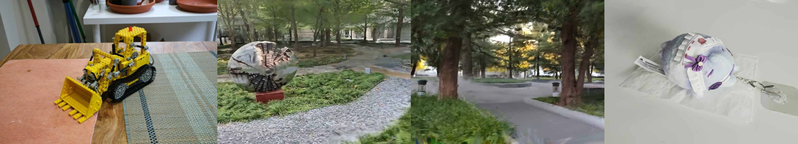
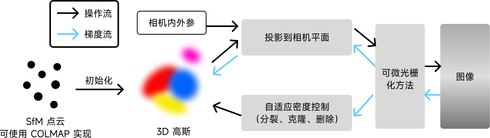
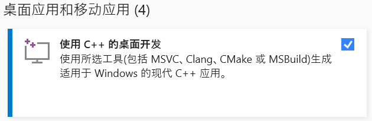
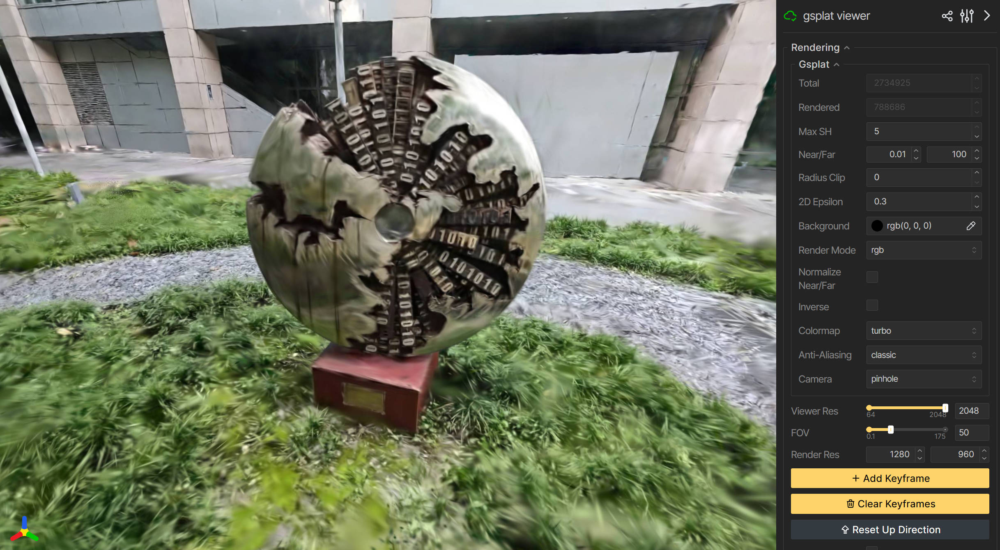

<div align="center">



# AI-2025-3DGS

<br />

北京航空航天大学 - 2025 年秋季

《人工智能原理与应用》课程大作业（第 2 组）

</div>

## ✨ 项目亮点

- 使用 gsplat（高效高斯渲染）加速模型训练过程；
- 调优 COLMAP 特征参数以提高配准与重建质量；
- 提供基于 Viser 的网页查看器；
- 可在自采数据集上完成训练，实现从实景拍摄到三维重建全流程。



## 🗂️ 项目结构

|                Name | Function                                         |
| ------------------: | :----------------------------------------------- |
|           datasets/ | COLMAP 结构化数据读取、归一化与轨迹处理脚本      |
|                doc/ | 说明文档                                         |
| gaussian-splatting/ | 传统光栅化后端的高斯点云实现                     |
|            scripts/ | 计算图像拉普拉斯方差的脚本                       |
|   simple_trainer.py | 基于 gsplat 的最小训练管线                       |
|    simple_viewer.py | 训练结果的 Viser 前端入口                        |
|          convert.py | Inria, Copyright (C) 2023 提供的 COLMAP 转换脚本 |
|    gsplat_viewer.py | 以 gsplat 渲染器为核心的快速浏览器               |
|            utils.py | 通用工具函数                                     |
|    requirements.txt | Python 依赖清单                                  |

- 项目主体以 `simple_trainer.py`、`simple_viewer.py` 与 `datasets/` 为核心，依托 `gsplat` 完成三维高斯重建；
- 仓库同时保留了 `gaussian-splatting/` 中基于传统光栅化后端的实现，该版本经过实机测试同样可以跑通。

> 由于传统光栅化后端实现的安装流程依赖多套编译工具链、环境变量及自定义脚本，配置过程较为繁琐，故本项目不再提供额外的安装教程。如有需要，按照[原仓库](https://github.com/graphdeco-inria/gaussian-splatting)的指引准备环境后，即可使用传统光栅化后端实现 3DGS。逐步配置教程可参考[此视频](https://www.youtube.com/watch?v=UXtuigy_wYc)。

## 🖥️ 系统环境需求

- **NVIDIA GPU (>= 6GB VRAM)** - 本项目仅在 NVIDIA GeForce RTX 3060 Laptop GPU 上测试通过；
- **CUDA Toolkit** - 本项目在 v12.4 上测试通过，通过 `nvcc --version` 查看版本号；
- **Visual Studio 2019 或更新版本** - 请确保已通过 Visual Studio 正确安装 **Desktop Development with C++** 组件；



- **COLMAP** - COLMAP 是一个开源的运动推断结构 (SfM) 和多视图立体重建 (MVS) 工具，本项目使用 COLMAP 从无序的图片集合中自动提取相机的姿态（外参）以及重建场景的三维点云；
- **ImageMagik** - 用于预处理数据集的实用工具；
- **FFmpeg** - 用于从视频中抽帧；注意：<7.0.0 的版本可能无法正确处理 Dolby Vision（杜比视界）格式的 HDR 视频，建议使用最新发行版。

## ⚙️ 环境配置

### 运行环境

- **Python** 3.10.x
- **Pytorch** 2.4.1+cu124
- **gsplat** 1.5.3+pt24cu124 - 从[官方仓库](https://github.com/nerfstudio-project/gsplat)使用[预构建版本](https://docs.gsplat.studio/whl/gsplat/)安装

### 安装依赖

由于第三方库 [pycolmap](https://github.com/rmbrualla/pycolmap) 存在版本适配问题，本项目对该仓库进行了修改，因此需要手动安装。

```bash
SET DISTUTILS_USE_SDK=1  # 使用已设置好的 Visual Studio 环境编译运行库
pip install -r requirements.txt
pip install -e .\submodules\pycolmap\
```

## 🚀 快速开始

本教程将逐步指导用户进行数据处理和模型训练。

### Step 1：抽帧

用 ffmpeg 以帧率 `FPS` 将视频 `VIDEO` 抽帧到目录 `FRAMES_DIR`：

```bash
ffmpeg -hide_banner -y -i "{{VIDEO}}" -vf "fps={{FPS}}" "{{FRAMES_DIR}}/frame_%05d.jpg
```

### Step 2：去模糊

用拉普拉斯方差（VoL）以百分位 `PERCENTILE` 过滤模糊帧，保留到目录 `KEPT_DIR`，并输出 CSV 统计表格到 `CSV`：

```powershell
python "scripts/blur_laplacian_filter.py" `
    -i "{{FRAMES_DIR}}" `
    -o "{{KEPT_DIR}}" `
    --csv "{{CSV}}" `
    --percentile {{PERCENTILE}}
```

### Step 3：COLMAP 重建

COLMAP 重建好的数据将存放于 `out/colmap`：

```text
out/
  └── colmap/
      ├── images/
      ├── sparse/
      └── database.db
```

#### 特征提取：单镜头、共享内参

从图片序列文件夹 `COLMAP_IMAGES` 提取特征：

```powershell
colmap feature_extractor `
    --database_path "out/colmap/database.db" `
    --image_path "{{COLMAP_IMAGES}}" `
    --ImageReader.camera_model SIMPLE_RADIAL `
    --ImageReader.single_camera 1 `
    --SiftExtraction.use_gpu 1 `
    --SiftExtraction.max_image_size 2000
```

#### 顺序匹配：视频序列推荐 & 闭环检测

```powershell
colmap sequential_matcher `
    --database_path "out/colmap/database.db" `
    --SequentialMatching.overlap 5 `
    --SequentialMatching.quadratic_overlap 1 `
    --SequentialMatching.loop_detection 1 `
    --SequentialMatching.loop_detection_period 10 `
    --SequentialMatching.loop_detection_num_images 50
```

#### 增量建图：略放宽注册阈值以提升注册率

```powershell
colmap mapper `
    --database_path "out/colmap/database.db" `
    --image_path "{{COLMAP_IMAGES}}" `
    --output_path "out/colmap/sparse" `
    --Mapper.abs_pose_min_num_inliers 15 `
    --Mapper.abs_pose_max_error 8
```

### Step 4：模型训练

- 模型训练结果将保存至 `result/{{SCENE_NAME}}`；
- 训练过程中，迭代至 7000 或 30000 次时，将保存 checkpoint。

```powershell
python .\simple_trainer.py default `
    --data_dir out/colmap `
    --data_factor 1 `
    --result_dir result/{{SCENE_NAME}}'
```

### Step 5：结果可视化

```powershell
python simple_viewer.py `
    --ckpt ./result/{{SCENE_NAME}}/ckpts/ckpt_{{iters}}_rank0.pt'
```


