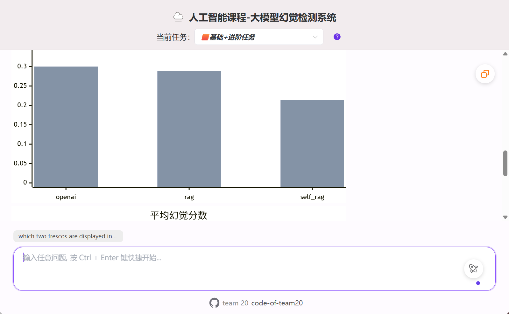
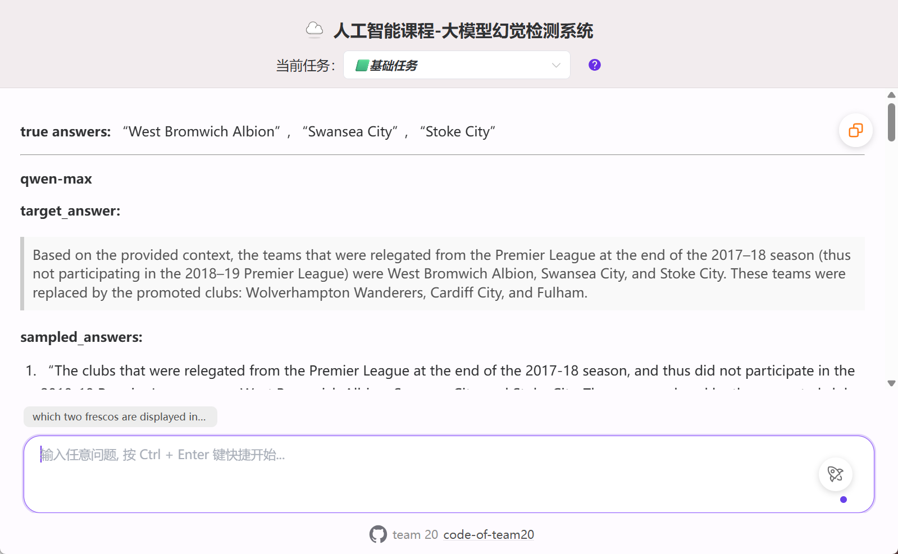
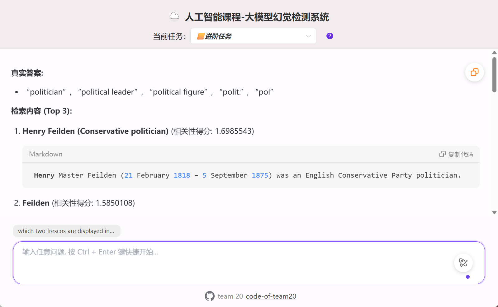

# 🤖 AI4Hallucination 幻觉评测工坊

跨数据集、跨策略地评估和缓解大语言模型幻觉的多模块研究仓库，涵盖 RAG/SELF-RAG、CoVe 验证链、SelfCheckGPT、自定义指标以及可视化分析。

[](https://www.python.org/downloads/)
[](https://docs.ragas.io/)
[](#)

> **🚀 [快速开始](docs/QUICKSTART.md)** | **📊 [评估指标](#-评估指标)** | **🧪 [模块说明](#-详细文档)** | **🛠️ [配置指南](#-配置说明)** | **📁 [文档索引](docs/README.md)**


## 📋 目录

- [功能特性](#-功能特性)
- [系统架构](#-系统架构)
- [快速开始](#-快速开始)
- [详细文档](#-详细文档)
- [项目结构](#-项目结构)
- [评估指标](#-评估指标)
- [演示输出](#-演示输出)
- [配置说明](#-配置说明)
- [高级用法](#-高级用法)
- [性能优化建议](#-性能优化建议)
- [常见问题](#-常见问题)
- [参考文献](#-参考文献)
- [贡献与许可证](#-贡献与许可证)

## ✨ 功能特性

### 基础能力
- ✅ **多数据集评测**：开箱支持 ASQA、FactScore 等长文本任务，可通过 YAML 配置设定抽样数量。
- ✅ **多求解器编排**：整合 direct answer、RAG、SELF-RAG、CoVe、SelfCheckGPT 等方法，自由组合对比。
- ✅ **统一评估接口**：Evaluator 统一驱动 RAGAS 与自定义指标，结果以 YAML/JSON 保存。
- ✅ **多语言日志**：内置英中翻译辅助，便于跨语种展示。

### 进阶能力
- ✅ **SELF-RAG 全链路**：`modules/selfrag-official/` 复现官方实现，`modules/selfrag-lite/` 提供轻量实验脚本。
- ✅ **CoVe 幻觉验证链**：`modules/cove/` 集成 LettuceDetect，对 baseline 与验证链结果进行 span 级检测。
- ✅ **SelfCheckGPT 校验**：`modules/selfcheckgpt/` 提供可复用的检测头，可插入任意 RAG pipeline。
- ✅ **可视化与报告**：生成对比图、presentation 以及日志，支持科研复现与成果汇报。

### 评估与报表
- ✅ **RAGAS 指标族**：Faithfulness、Context Precision/Recall、Correctness、Fluency、Coherence、Conciseness 等。
- ✅ **日志与输出管理**：统一存放在 `modules/comprehensive/outputs/`、`modules/selfrag-lite/self_rag_output*/`。
- ✅ **可扩展指标**：YAML 配置可快速增删指标，缺失项默认 `null` 不影响流程。

## 🏗️ 系统架构

```
┌────────────────────────────────────────────────────────────┐
│                AI4Hallucination 评测总体流程                │
└────────────────────────────────────────────────────────────┘

┌───────────┐    ┌────────────┐    ┌────────────┐    ┌───────────┐
│ 数据集管理 │ => │ 求解器调度 │ => │ 评估器/检测 │ => │ 结果记录  │
│ (Dataset) │    │ (Solvers)  │    │ (Evaluator) │    │ (Reports) │
└───────────┘    └────────────┘    └────────────┘    └───────────┘
       ↑                 ↓                ↓                │
       │         ┌────────────┐    ┌────────────┐         │
       │         │ Retriever  │ <= │ 向量索引    │         │
       │         └────────────┘    └────────────┘         │
       │                 ↓                ↓                │
       └────────  数据准备 & 缓存  ───────┴───────→  YAML/JSON
```

## 🚀 快速开始

### 环境要求
- Python 3.10+
- 16GB RAM（SELF-RAG 推理建议 24GB+ GPU，或使用 OpenAI/LiteLLM 在线模型）
- NVIDIA GPU + CUDA（可选，用于 vLLM、自建向量索引或 LettuceDetect）

### 安装流程

```bash
git clone <your-repo-url>
cd ai4hallucination-main
python -m venv .venv
source .venv/bin/activate   # Windows: .venv\Scripts\activate

# 推荐：一键脚本
bash scripts/setup.sh

# 或手动
pip install -r modules/selfrag-official/requirements.txt
pip install -U vllm transformers ragas datasets gradio lettucedetect
pip install -e modules/selfcheckgpt
```

### 数据准备

- 将原始语料放在 `modules/comprehensive/data/` 或 `modules/selfrag-lite/eval_data/`，格式参考各目录示例。
- SELF-RAG 任务可直接使用 `modules/selfrag-lite/eval_data/asqa_eval_gtr_top100.json` 等文件。
- CoVe pipeline 读取 `modules/cove/question.json`；请确保字段 `{question, context}` 齐全。

更多面向新人指南请参考 [`docs/QUICKSTART.md`](docs/QUICKSTART.md)。

## 📖 详细文档

### 1. Comprehensive 统一评测流程

```bash
bash scripts/run_comprehensive.sh
```

- 配置项来自 `modules/comprehensive/config.yaml`，可并行指定数据集、Solver、Evaluator。
- 评估结果写入 `modules/comprehensive/outputs/eval_results/<dataset>/<question>/<solver>.yaml`。
- 日志内置翻译辅助，便于汇报；更多说明见 [`docs/WORKFLOWS.md`](docs/WORKFLOWS.md)。

### 2. SELF-RAG 官方复现 (`modules/selfrag-official/`)
- 参考 [`modules/selfrag-official/README.md`](modules/selfrag-official/README.md) 获取训练、推理、评估指令。
- `run_evaluation.sh` / `evaluate_with_ragas.py` 支持批量实验，`visualize_results.py` 生成图表。
- `presentation_*.md` 汇总多轮实验，可直接用于分享。

### 3. SELF-RAG & SelfCheckGPT 轻量实验 (`modules/selfrag-lite/`)

```bash
bash scripts/run_selfrag_lite.sh
```

- `self-rag.py`：交互式 RAG Demo，调试检索效果。
- `ragas_eval.py`：按需调用 RAGAS，输出 ContextRecall/Faithfulness/FactualCorrectness。
- `hallucination_detection.py`：示例自定义检测脚本，可串联 SelfCheckGPT。

### 4. CoVe 幻觉验证链 (`modules/cove/`)

```bash
bash scripts/run_cove.sh
```

- 基于 `lettucedetect` 的 `HallucinationDetector`，默认模型 `KRLabsOrg/lettucedect-base-modernbert-en-v1`。
- `question.json` 中需要 `{question, context}` 字段，可自定义。
- 输出 JSON 同时记录 baseline/CoVe 预测 span，便于可视化对比。

### 5. SelfCheckGPT 组件 (`modules/selfcheckgpt/`)
- `demo.py` 演示 n-gram、MQAG、自回归比对等策略。
- `modeling_selfcheck*.py` 提供可拓展检测头，可被其他模块复用。
- 通过 `pip install -e modules/selfcheckgpt` 后，任意 pipeline 均可 `from selfcheckgpt import ...`。

## 🗂️ 项目结构

```
ai4hallucination-main/
├── README.md
├── docs/
│   ├── README.md            # 文档索引
│   ├── ARCHITECTURE.md      # 架构蓝图
│   ├── WORKFLOWS.md         # 工作流手册
│   └── QUICKSTART.md        # 新人指南
├── modules/
│   ├── comprehensive/       # 统一配置的多数据集评测主流程
│   │   ├── dataset/         # 数据集基类与加载逻辑
│   │   ├── solver/          # direct / rag / self-rag / cove / selfcheckgpt
│   │   ├── evaluator/       # RAGAS 与自定义指标封装
│   │   ├── utils/           # 配置、翻译、格式化
│   │   ├── outputs/         # 评测产物
│   │   ├── config.yaml
│   │   └── main.py
│   ├── cove/                # CoVe 验证链实验（含 LangChain chain）
│   ├── selfrag-official/    # 官方 SELF-RAG 代码与脚本
│   ├── selfrag-lite/        # 轻量 SELF-RAG & SelfCheckGPT 实验
│   └── selfcheckgpt/        # 自检模块，可安装为库
└── scripts/
    ├── setup.sh             # 安装依赖与虚拟环境
    ├── run_comprehensive.sh
    ├── run_selfrag_lite.sh
    └── run_cove.sh
```

## 📊 评估指标

### 离线指标
- **Accuracy / Correctness**：回答与参考答案的整体一致度。
- **Relevance**：回答内容相对问题的相关性。
- **Context Precision / Recall / Relevance**：检索上下文命中率与纯度。
- **Faithfulness / Factual Correctness**：基于资料或事实的忠实度检测。
- **Conciseness / Coherence / Fluency**：文本质量维度。

### 在线/运行指标
- **平均延迟 / P95 / P99**：`modules/selfrag-lite/run_long_form_static.py`、`modules/comprehensive/main.py` 日志均会记录。
- **吞吐量**：`run_long_form_static.py` 汇报总耗时与平均样本耗时。
- **检索命中率**：retriever debug 日志 (`split sentences / ctxs`)。

### 幻觉检测指标
- **Span-Level Hallucination Rate**：CoVe + LettuceDetect 输出的 span 级检测率。
- **SelfCheckGPT Scores**：n-gram / MQAG 检测头得分。

## 🎮 演示输出

### Comprehensive CLI 日志（节选）
```
python modules/comprehensive/main.py
正在使用数据集 asqa [1 / 2] 对模型进行评估...
    使用 direct-answer [openai/gpt-4o] 回答问题...
    使用 ragas 评估答案...
    评估结果: {'faithfulness': 0.82, 'context_recall': 0.9, 'overall_quality': 0.78}
```

### CoVe 检测结果（示例）
```json
{
  "question": "What is AI safety?",
  "baseline_response": "...",
  "final_answer": "...",
  "baseline_predictions": [{"span": "AI will never fail", "label": "hallucination"}],
  "cove_predictions": []
}
```

## ⚙️ 配置说明

### `modules/comprehensive/config.yaml`
```yaml
dataset:
  - name: asqa
    type: long-form
    number: 10
solvers:
  - method: direct-answer
    type: online
    model: openai/gpt-4o
  - method: use-rag
    type: online
    model: openai/gpt-4o
    rag_docs_number: 5
  - method: use-self-rag
    model: selfrag/selfrag_llama2_7b
evaluators:
  - method: ragas
    model: gpt-4o
    metrics:
      - faithfulness
      - context_recall
extra:
  output_dir: ./outputs
```

### 环境变量示例
```bash
export OPENAI_API_KEY=sk-...
export OPENAI_BASE_URL=https://api.openai.com/v1
export HF_ENDPOINT=https://hf-mirror.com
export CUDA_VISIBLE_DEVICES=0
export LLM_CACHE=./model_cache
```

> ✅ 建议把密钥写入 `.env` 并由 shell profile 或 `direnv` 自动加载，避免泄露。

## 🔧 高级用法

### 自定义数据集
```python
from llm_hallucination_evaluate.dataset.base import MutiDataSet

class MyDataset(MutiDataSet):
    name = "mybench"
    type = "long-form"
```
- 注册到 `modules/comprehensive/dataset/__init__.py` 后即可在 YAML 中引用。

### 扩展求解器
- 继承 `MultiSolver` 并实现 `solve`，可引入新的 RAG、Tool-Augmented 或 Verification 策略。
- 在配置中添加 `method` 与 `extra_args`（如 `max_depth`, `threshold`）。

### 自定义评估
- `Evaluator.single_evaluate` 支持返回任意 JSON，可对接 BLEU、ROUGE 或 Toxicity。
- `modules/selfrag-lite/ragas_eval.py` 示范如何将生成结果转换为 RAGAS `EvaluationDataset`。

### 幻觉检测管线
- `modules/cove/main.py` 展示如何串联 LangChain Chain + LettuceDetect。
- `modules/selfcheckgpt/modeling_*` 提供 MQAG、n-gram、Self-Check Prompt 等策略，可挂在任何 pipeline 末端。

## 📈 性能优化建议
1. **检索优化**：调整 `ndocs`、`rag_docs_number`，使用混合检索或 reranker 提升上下文命中。
2. **生成优化**：SELF-RAG 的 `max_depth`、`threshold`、`mode` 控制检索深度与计算量。
3. **计算资源**：使用 vLLM + FlashAttention，必要时采用 4bit/8bit 量化或在线 API。
4. **评估效率**：RAGAS 指标支持批处理或缓存，可通过 `dataset.number` 控制规模。
5. **检测扩展**：LettuceDetect 支持 GPU 推理，SelfCheckGPT 可多头并行并复用 embeddings。

## 🐛 常见问题

**Q1: 运行 LettuceDetect 报错？**  
A: 确认已安装 `torch`, `transformers` 并可访问 `KRLabsOrg/lettucedect-base-modernbert-en-v1`。必要时设置 `HF_ENDPOINT`。

**Q2: SELF-RAG 推理显存不足？**  
A: 调整 `--tensor-parallel-size`、使用 4bit/8bit 量化或在线模型，并降低 `max_new_tokens`。

**Q3: RAGAS 评估卡住？**  
A: 确认配置了可用 API（OpenAI/LiteLLM），并减少并发指标数量。

**Q4: 新增 solver 不生效？**  
A: 确保 `method` 名称与实现一致，并确认日志未提示缓存命中；必要时清空 `modules/comprehensive/outputs`.

**Q5: 如何复用旧评估结果？**  
A: `outputs/eval_results/...yaml` 存在时会自动跳过，可删除目录或设置新的 `output_dir` 重新运行。

**Q6: 模型下载缓慢？**  
A: 设置 `HF_ENDPOINT` 或提前将模型放入 `model_cache`；vLLM 支持 `--download-dir`。

**Q7: 如何集成新的幻觉检测器？**  
A: 在 `modules/selfcheckgpt` 中新增 `modeling_xxx.py`，然后在 `modules/comprehensive/solver` 或 `modules/cove` pipeline 中调用。
## 🖼️ 可视化展示

<div align="center">
  
  
  
</div>
## 📚 参考文献

- [SELF-RAG: Learning to Retrieve, Generate, and Critique through Self-Reflection](https://arxiv.org/abs/2310.11511)
- [Chain-of-Verification for Complex Reasoning](https://arxiv.org/abs/2309.11481)
- [SelfCheckGPT: Zero-Resource Hallucination Detection](https://arxiv.org/abs/2303.08896)
- [RAGAS: Automated Evaluation of Retrieval-Augmented Generation](https://arxiv.org/abs/2309.15217)
- [LettuceDetect](https://github.com/KRLab-github/lettucedetect)

## 🤝 贡献与许可证
- 欢迎通过 Issue/PR 反馈复现问题、分享新的评估脚本或数据集。
- 各模块沿用上游项目的许可证（如 SELF-RAG 官方协议、SelfCheckGPT License 等），使用前请阅读对应 README/License。

## 🙏 致谢
- SELF-RAG、LangChain、RAGAS、LettuceDetect 及所有提供模型/工具的开源社区。

---

**⭐ 如果这个项目对你有帮助，请给一个 Star！**
